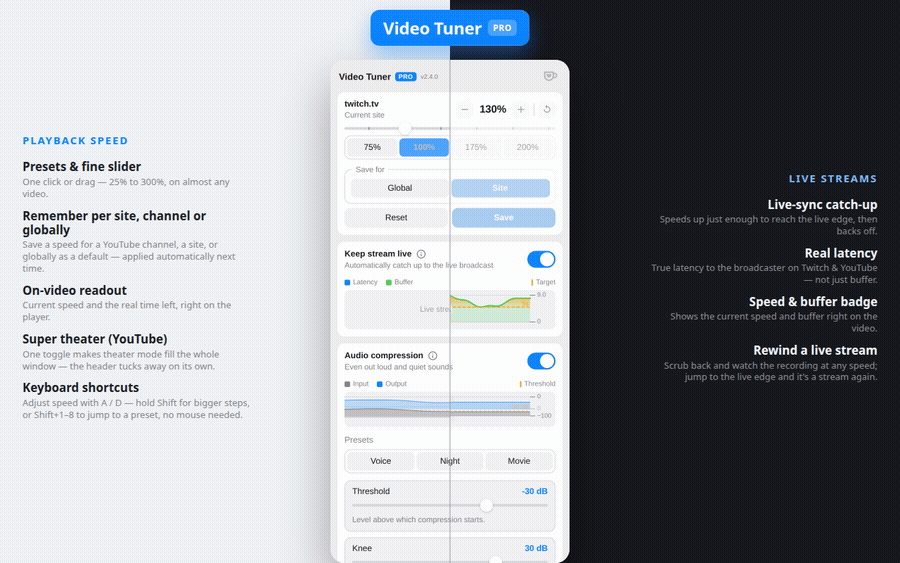

# Video Tuner Pro

Take control of any video on the web. Set the playback speed, keep live streams
on the live edge, and even out loud and quiet sounds — all from one little popup.
Works on virtually any site, in light and dark themes, in 10 languages, with no
accounts and no tracking.

## Install

- **Chrome / Edge / Brave:** [Chrome Web Store](https://chromewebstore.google.com/detail/video-tuner-pro/ichlipldofdemkhlhnoekfkpfejfanno)
- **Firefox:** [Firefox Add-ons](https://addons.mozilla.org/ru/firefox/addon/video-tuner-pro/)

## What it does

- **Playback speed** — one-click presets or a fine slider, on almost any video.
- **Remember per site** — save a speed for a site and it's applied automatically next time. Other sites stay at normal speed.
- **Live-sync** — automatically catches live streams back up to the live edge, then returns to normal.
- **Audio compression** — evens out loud and quiet parts so you don't keep reaching for the volume.
- **On-video readout** — optional badge showing the current speed and how much time is really left at that speed.
- **Live graphs** — see the audio levels and the live-stream buffer in real time.
- **Light & dark themes**, 10 languages, and **no tracking** — nothing leaves your device.

## How to use

1. Open a page with a video and click the extension icon.
2. Drag the slider or pick a preset — the speed changes instantly. The toolbar icon shows the current speed.
3. Click **Remember site** to keep that speed for the site.

Turn on **Show speed & time on video** to see the speed and the real remaining
time right on the player — it appears when you move the mouse and fades away on
its own.

## Live streams

On a live stream (YouTube Live, Twitch, etc.) the manual speed controls are off —
changing speed wouldn't make sense for a live broadcast. Instead, turn on
**Live-sync**:

- If you drift behind the live broadcast (after a pause, a stall, or switching
  tabs), it speeds up just enough to catch back up, then returns to normal.
- Two settings: **Allowed delay** (how far behind to tolerate) and **Catch-up
  speed** (how fast to catch up).

## Audio compression

Turn it on to make quiet parts more audible and stop loud parts from blasting —
great for movies with whispery dialogue and explosive action, or noisy streams.
You can fine-tune it or just leave the defaults, and a live meter shows the
effect. On a few sites the browser blocks audio processing, and the extension
will tell you when that happens.

## Privacy

No accounts, no analytics, no data ever leaves your browser. Your settings sync
through your own browser profile only. See [PRIVACY.md](PRIVACY.md).

## License

[GPL-3.0](LICENSE) © slonick.dev

Free to use, study, modify and share. If you distribute a modified version —
including publishing a fork to a store — it must stay open source under the same
GPL-3.0 license.
